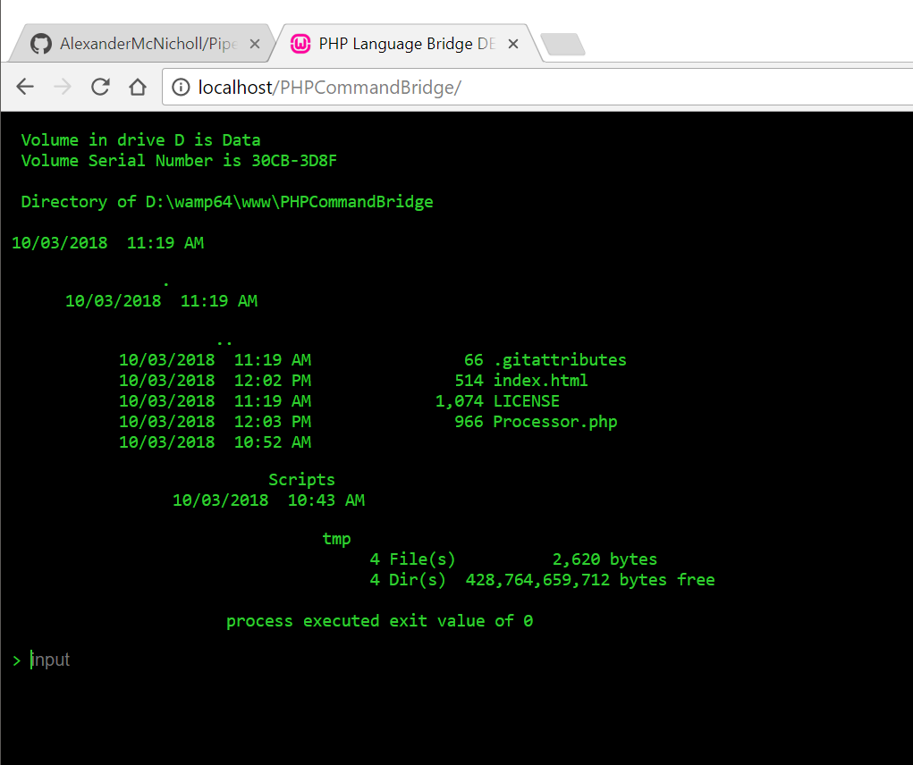

# Pipe-line
A repo for executing client commands on the server side.

# Usage
Pipe-line can be used by simply including the php file and scripts folder in your projects root directory.
Pipe-line comes with a basic index.html file for testing its functionality. it allows its user to type in a command and watch it get executed on the server side operating system.
to run a Pipe-line command, simply use:

```
executeCommand( command, outElement, inputs = null );
```
This will execute the entered command and dump the output to the element with the id of outElement. You can also enter a function directly to be directly called and the output data will be passed into the function as a paramater. E.g.
```
executeCommand( "time", null, null, function( e ) {
      alert(e);
 });
 ```
 This will alert the data that is returned from the command, which is just the time.

# Examples
In the included example document you can see the ```executeCommand( command, outElement, inputs = null );``` command being used with an interative client and server side command line, as shown below.


# Future updates
Pipe-line aims to later include:
* Full support for installation using npm.
* node.js releases.

# Release notes
* Pipe-line initial commit.
